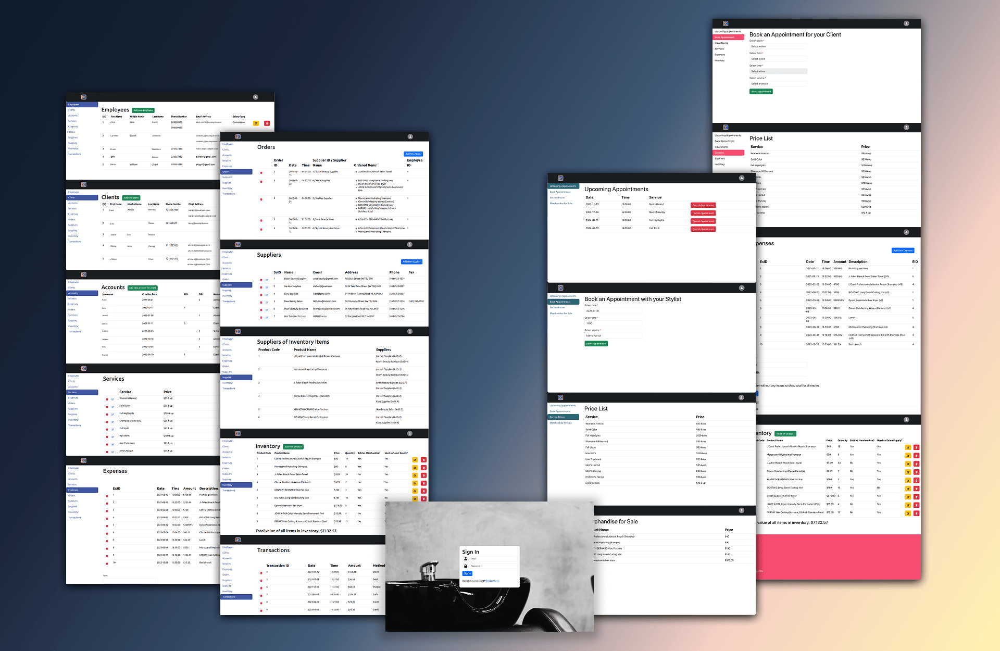

<a id="readme-top"></a>

<div align="center">
  <a href="https://github.com/">
    
  </a>

  <h3 align="center">Hairmonize</h3>
  <p align="left">
      Hairmonize is a web-based salon management application designed to modernize and streamline hair salon operations. The project was initiated in response to the inefficiencies of traditional paper-based systems, including appointment books, customer index cards, and manual transaction records.
      <br/>
      <br/>
  </p>
  <a href="https://github.com/"><strong>Explore the docs »</strong></a>
  <br/>
  <br/>
  <p>
    
    
  </p>
</div>

<!-- TABLE OF CONTENTS -->
  <details>
    <summary>Table of Contents</summary>
    <ol>
      <li>
        <a href="#about-the-project">About The Project</a>
        <ul>
          <li><a href="#features">Features</a></li>
          <li><a href="#built-with">Built With</a></li>
        </ul>
      </li>
      <li>
        <a href="#getting-started">Getting Started</a>
      </li>
      <li>
        <a href="#frontend">Frontend</a>
      </li>
      <li>
        <a href="#backend">Backend</a>
      </li>
      <li><a href="#acknowledgments">Acknowledgments</a></li>
    </ol>
  </details>

<!-- ABOUT THE PROJECT -->

## About The Project



<p align="right">(<a href="#readme-top">back to top</a>)</p>

### Features

#### For Salon Staff:

- View, create, and delete accounts
- View, create, and delete appointments
- Maintain detailed customer profiles
- Access transaction and service records
- Secure login with role-based access control

#### For Customers:

- Log in to view upcoming appointments
- Create appointments
- Edit personal information (e.g., contact number)
- Self-service reduces the need to call the salon

<p align="right">(<a href="#readme-top">back to top</a>)</p>

### Built With

- [![React][React.js]][React-url]
- [![Node.js][Node.js]][Node-url]
- [![Express.js][Express.js]][Express-url]
- [![MySQL][MySQL]][MySQL-url]
- [![JWT][JWT]][JWT-url]
- [![JavaScript][JavaScript]][JavaScript-url]
- [![HTML5][HTML5]][HTML5-url]
- [![CSS][CSS]][CSS-url]

<p align="right">(<a href="#readme-top">back to top</a>)</p>

## Getting Started

### Installation

Clone this project from git onto your computer

### MYSQL SERVER:

Before starting the program, the MySQL server and user authentication needs to be configured properly, otherwise the application will not be able to communicate with the server. All privileges may need to be granted to then MySQL user account. To do so:

#### Linux:

1. Open a terminal
2. Run in terminal: `sudo my sql and then log in`
3. Run in terminal: `ALTER USER 'root'@'localhost' IDENTIFIED WITH mysql_native_password BY 'password';`

   - Replace password with you actual password, but retain the single quote marks.

4. Run in terminal: `FLUSH PRIVILEGES;`
5. Run in terminal `GRANT ALL PRIVILEGES ON “your database name here”.* TO 'User account name here'@'localhost';`
6. Run in terminal: `FLUSH PRIVILEGES;`

<p align="right">(<a href="#readme-top">back to top</a>)</p>

#### Windows/MacOS

1. Open MySQL work bench or datagrip.
2. Access your root server, then open a query terminal.
3. Run: `ALTER USER 'root'@'localhost' IDENTIFIED WITH mysql_native_password BY 'password';`

   - Replace password with your actual password, but retain the single quote marks.

4) Run: `FLUSH PRIVILEGES;`
5) Run: `GRANT ALL PRIVILEGES ON “your database name here”.* TO 'User account name here'@'localhost';`
6) Run: `FLUSH PRIVILEGES`;

<p align="right">(<a href="#readme-top">back to top</a>)</p>

### Database Structure

After setting up the MySQL environment the tables will need to be created. The table structures are provided in the schemas folder.

## FRONTEND:

1. In the terminal cd into the frontend directory
2. Install the dependencies

```
npm install
```

3. Run the front end

```
npm start
```

<p align="right">(<a href="#readme-top">back to top</a>)</p>

## BACKEND

1. In the terminal cd into the backend directory
2. Install the dependencies

```
npm install
```

3. In the backend directory, create a new javascript file inside of the backend called database.js (DO NOT COMMIT TO GIT):

```js
// database.js
import mysql from "mysql";

export const db = mysql.createConnection({
  host: "localhost",

  user: "your server user name",

  password: "your server password",

  database: "your database name (from data grip or whatever you're using)",
});
```

4. Start the backend

```
npm start
```

<p align="right">(<a href="#readme-top">back to top</a>)</p>

<!-- ACKNOWLEDGMENTS -->

## Acknowledgments

The following resources were used in developing this project:

- Lama Dev. (2022, September 18). React Node.js MySQL CRUD Tutorial for Beginners [Video]. YouTube. https://www.youtube.com/watch?v=fPuLnzSjPLE

- Lama Dev. (2022, September 26). React Node.js MySQL Full Stack Blog App Tutorial [Video]. YouTube. https://www.youtube.com/watch?v=0aPLk2e2Z3g&list=PLiNtaYczsCu3L-F8BrVsGNIt_7iQDxsLF&index=10

- Code With Yousaf. (2023, March 28). React + Node js + MySQL - CRUD Operations | CRUD Rest API with Node and Express [Video]. YouTube. https://www.youtube.com/watch?v=y5NvOade3sk&list=PLiNtaYczsCu3L-F8BrVsGNIt_7iQDxsLF&index=14&t=1125s

- Filter Array of Objects based on Values from Another Array. CodeWithLinda. (2020, November 19). https://www.codewithlinda.com/blog/filter-array-of-objects/

- Generate Array of months with moment - Reactjs. stack overflow. (2022, May 4). https://stackoverflow.com/questions/72111200/generate-array-of-months-with-moment-reactjs

### ReadMe Template

- [Best-README-Template](https://github.com/othneildrew/Best-README-Template/blob/main/BLANK_README.md#about-the-project)

<p align="right">(<a href="#readme-top">back to top</a>)</p>

<!-- Badge Links -->

[React.js]: https://img.shields.io/badge/React-61DAFB?style=for-the-badge&logo=react&logoColor=white
[React-url]: https://react.dev/
[Node.js]: https://img.shields.io/badge/Node.js-339933?style=for-the-badge&logo=nodedotjs&logoColor=white
[Node-url]: https://nodejs.org/
[Express.js]: https://img.shields.io/badge/Express.js-000000?style=for-the-badge&logo=express&logoColor=white
[Express-url]: https://expressjs.com/
[MySQL]: https://img.shields.io/badge/MySQL-00758F?style=for-the-badge&logo=mysql&logoColor=white
[MySQL-url]: https://www.mysql.com/
[JWT]: https://img.shields.io/badge/JWT-000000?style=for-the-badge&logo=jsonwebtokens&logoColor=white
[JWT-url]: https://jwt.io/
[JavaScript]: https://img.shields.io/badge/JavaScript-F7DF1E?style=for-the-badge&logo=javascript&logoColor=black
[JavaScript-url]: https://developer.mozilla.org/en-US/docs/Web/JavaScript
[HTML5]: https://img.shields.io/badge/HTML5-E34F26?style=for-the-badge&logo=html5&logoColor=white
[HTML5-url]: https://developer.mozilla.org/en-US/docs/Web/HTML
[CSS]: https://img.shields.io/badge/CSS-1572B6?style=for-the-badge&logo=css&logoColor=white
[CSS-url]: https://developer.mozilla.org/en-US/docs/Web/CSS
